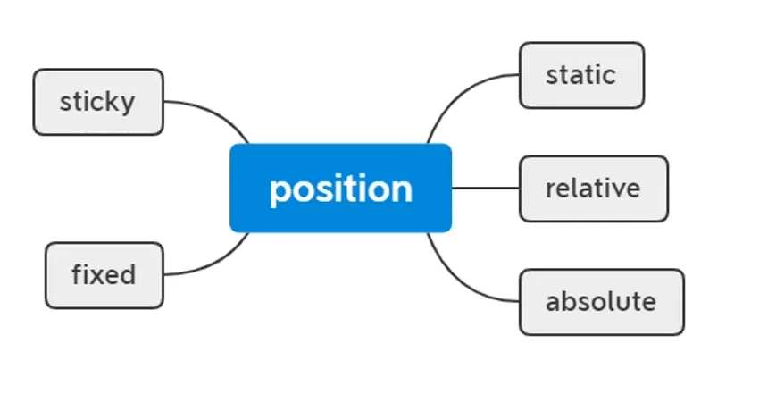

**在 CSS 中，position 属性有五种取值**：

static（默认值）：

* 元素按照正常的文档流排列。
* top、right、bottom、left 和 z-index 属性无效。

relative：

* 元素没有脱离文档流，仍占据原有空间。
* 元素相对于其正常位置进行定位。
* 使用 top、right、bottom、left 调整位置，不影响其他元素布局。

absolute：

* 绝对定位的元素脱离了文档流，绝对定位元素不占据空间。
* 具备内联盒子特性：宽度由内容决定；
* 具备块级盒子特性：支持所有样式；
* 元素相对于最近的定位祖先元素（非 static）进行定位。
* 如果没有定位祖先，则相对于初始包含块（通常是视口，即可视区定位）。

fixed：

* 元素脱离文档流，不影响其他元素布局。
* 具备内联盒子特性：宽度由内容决定；
* 具备块级盒子特性：支持所有样式；
* 元素相对于视口定位，不随页面滚动而移动，也不受其他元素影响。

sticky：

* 元素在滚动到特定位置前表现为 relative，之后表现为 fixed。
* 需要指定 top、right、bottom 或 left 中的一个值来定义粘性位置。
